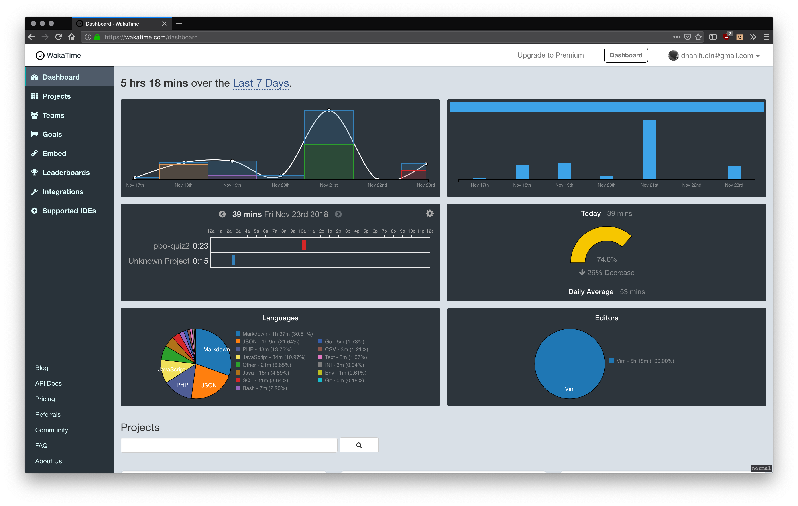
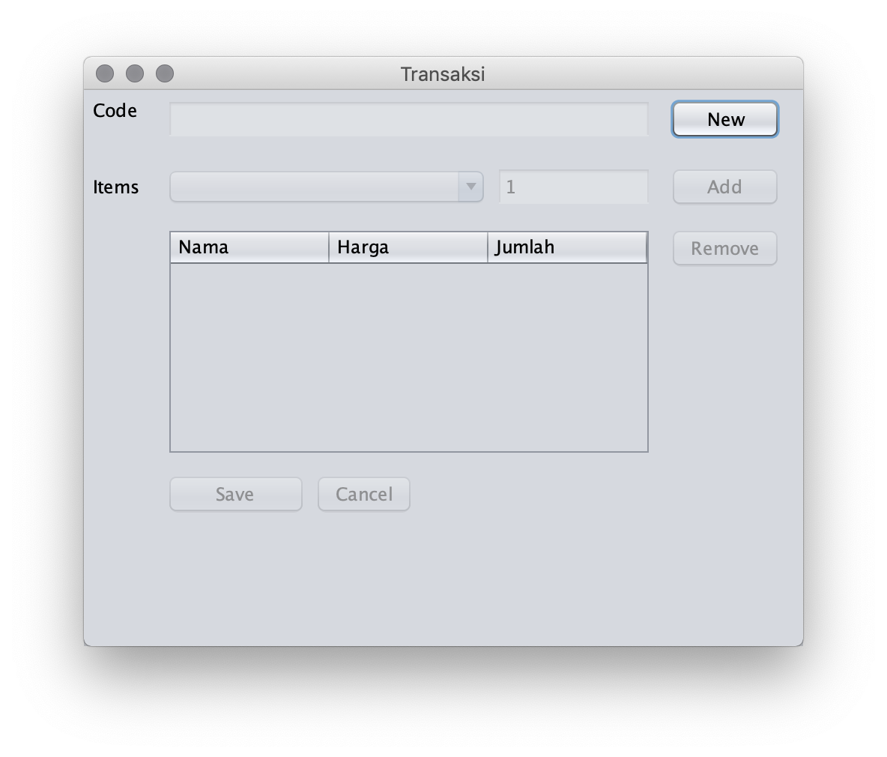
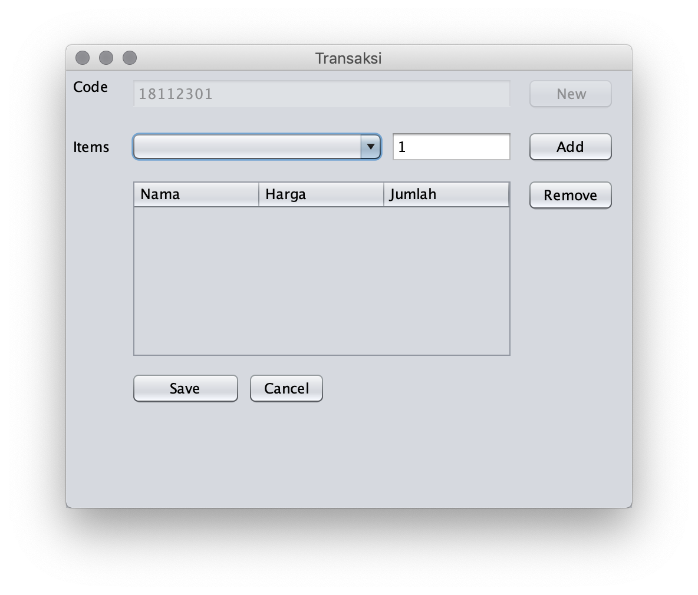
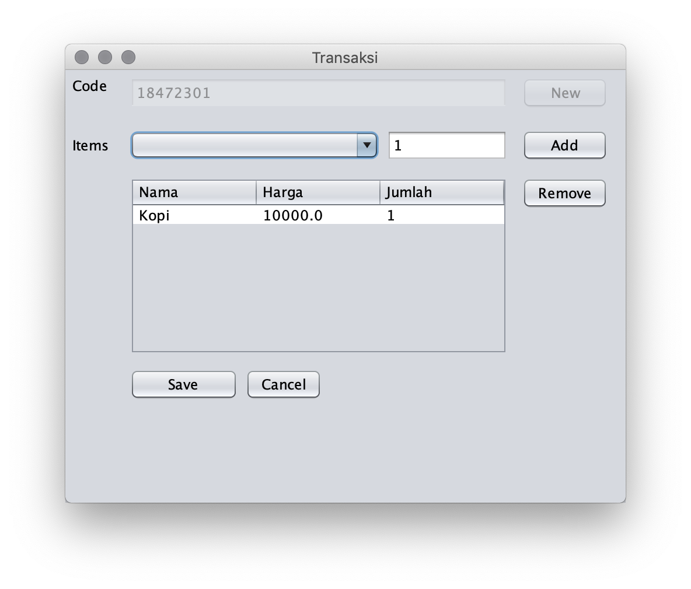
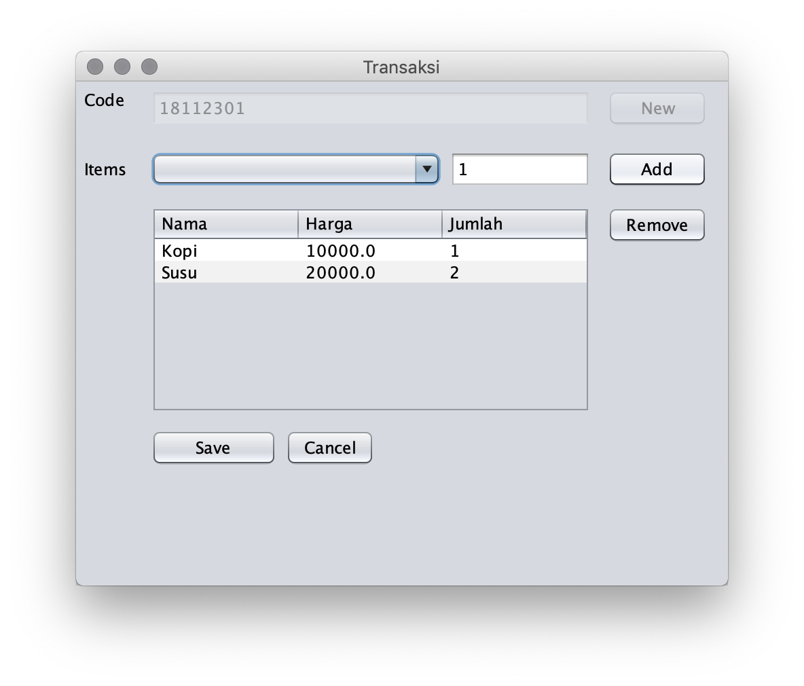
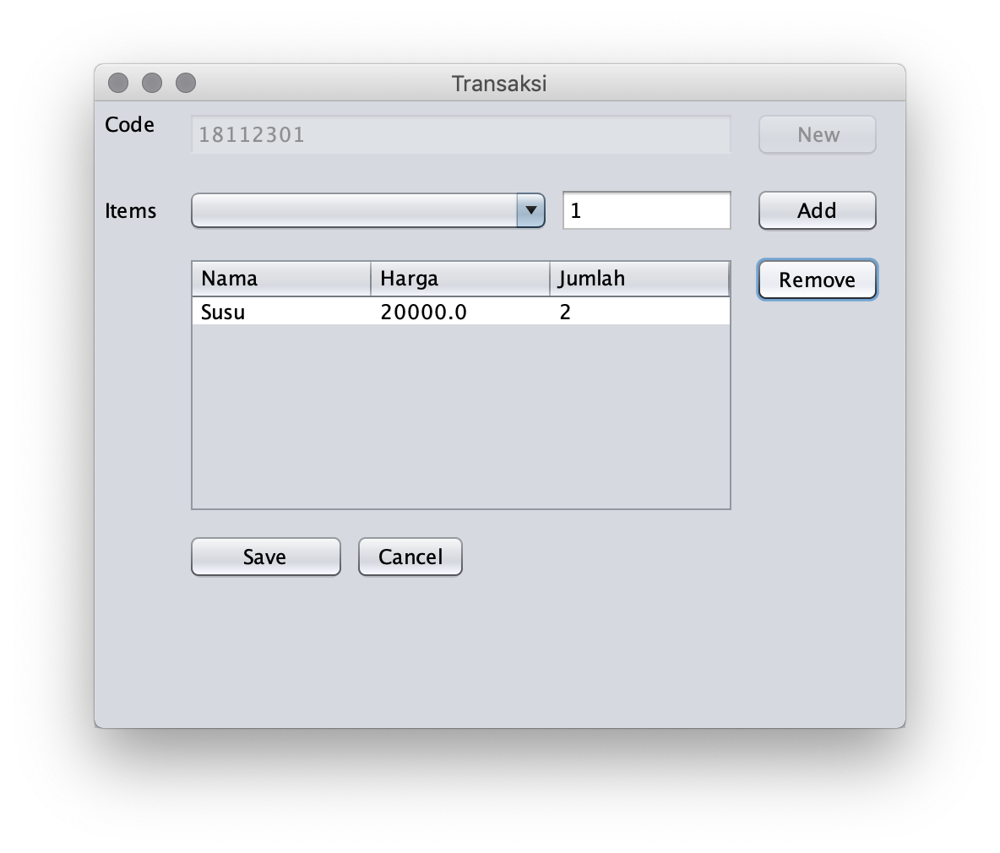
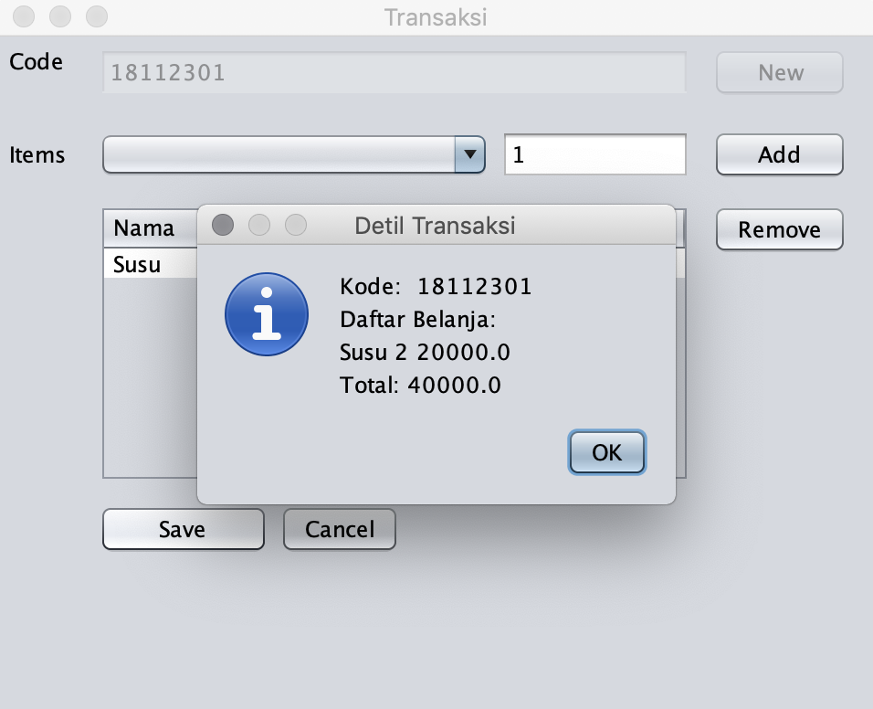

# Quiz 2

## Disclaimer

- **Bacalah instruksi langkah-langkah pengerjaan secara seksama. Nilai 0 jika
tidak sesuai dengan instruksi dan diperbaiki sebelum batas pengumpulan.**
- **Deadline**: 30 November 2018 23.59 WIB


## Langkah Pengerjaan

- Silahkan install plugins [Wakatime](wakatime.com) pada IDE netbeans, dan pastikan fitur tracking dapat berjalan dengan benar.
- Fork repository ini ke akun github anda.
- Setelah proses fork selesai, lakukan clone pada repository hasil fork pada akun anda.
- Buka project kemudian kerjakan pada template project yang telah disediakan, **jangan membuat project baru**
- **Screenshoot** dashboard wakatime anda tiap hari dan simpan pada folder `images/` selama melakukan pengerjaan, contoh tampilan dashboard dapat anda lihat sebagai berikut.



- Tambahkan komentar pada file source code java untuk setiap baris kode. Contoh:

  ```java
  // Deklarasi class Item untuk merepresentasikan barang
  // yang akan dimasukkan dalam daftar belanja.
  public class Item {
    // atribut yang digunakan untuk menyimpan nama barang
    private String name;
  }
  ```

- Untuk setiap pesan commit berisi pesan yang bermakna sesuai dengan perubahan apa yang telah dilakukan.

  ```
  Penambahan fungsi toggleUI() untuk toggle enable/disable UI
  ```

- Buatlah sebuah Frame untuk menangani program transaksi, sebagai tampilan awal dapat anda lihat pada gambar di bawah.



- Ketika tombol **New** ditekan, program akan me-*generate* kode transaksi dengan format `yyMMdd` ditambah dua digit counter transaksi pada hari tersebut.



- Pada combo box terdapat list barang yang dapat ditambahkan ke dalam keranjang belanja dengan menekan tombol **Add**



- Jika item sudah pernah ditambahkan ke dalam keranjang belanja, maka yang berubah hanya jumlah item.




- Daftar belanja dapat dihapus dengan memilih item yang akan dihapus kemudian menekan tombol **Remove**



- Ketika tombol **Save** ditekan akan muncul dialog berisi ringkasan transaksi serta total harga semua daftar belanja.



- Jika tombol **Cancel** ditekan maka tampilan akan kembali ke tampilan awal.
- Jika transaksi berhasil, maka untuk kode transaksi berikutnya akan otomatis
 digenerate ulang. Contoh: kode transaksi **18112301** maka transaksi berikutnya
 ketika tombol **New** ditekan adalah **18112302**


- Tambahkan error handling untuk hal-hal yang mungkin terjadi, contoh: error yang terjadi jika item belum dipilih pada saat proses **Add** atau **Remove**
- Jika anda telah selesai melakukan pengerjaan, lakukan **pull request** melalui tombol hijau yang akan muncul di sebelah kanan atas halaman project fork anda!
